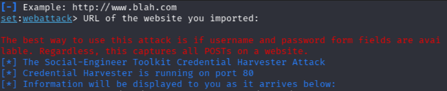
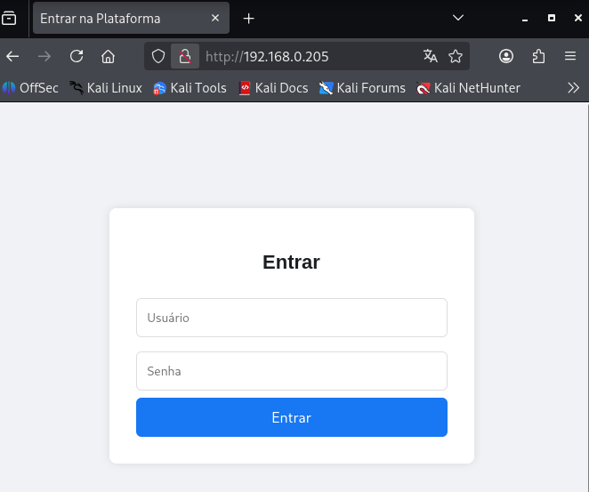
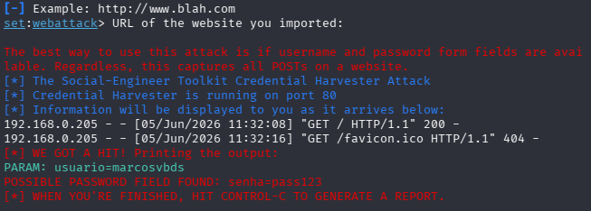
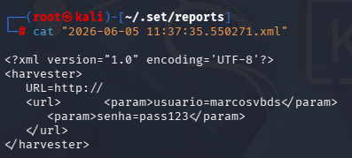

# 📘 Desafio DIO: Criação de um Phishing com o Kali Linux
## 🛠️ Metodologia
1. **Sistema Operacional**: Kali Linux
2. **Ferramenta utilizada**: *setoolkit*
3. **Simulação**: criação de uma página de login falsa (index.html)

## ⚙️ Configuração do Ambiente
**Acesso root:** `sudo su`

**Iniciando o setoolkit:** *`setoolkit`*

**Tipo de ataque:** `Social-Engineering Attacks`

**Vetor de ataque:** `Web Site Attack Vectors`

**Método de ataque:** `Credential Harvester Attack Method` 

**Método de ataque:** `Custom Import`

**Obtendo o endereço da máquina:** `Index.html`

Informamos o caminho da criação do arquivo index.html (página de login falsa) no Kali Linux. Depois disso, há o direcionamento, a partir do IP da máquina, que serve a página de login falsa na porta 80.

Acessando pelo navegado do Kali Linux, inserimos um usuário e senha. Ao clicar no botão Entrar, esses dados são automaticamente capturados e exibidos no console do *setoolkit*.

## 📊 Resultados

Após a captura dos dados, podemos gerar um relatório via arquivo xml, a partir do comando `crlt + c`. Na sequência o comando `ls -a /root/.set/reports/` mostrará o resumo do que foi capturado no terminal.

   ⚠️ **Aviso importante:** Nenhuma credencial real foi coletada. O desafio é estritamente educacional e não deve ser utilizado para fins maliciosos.
