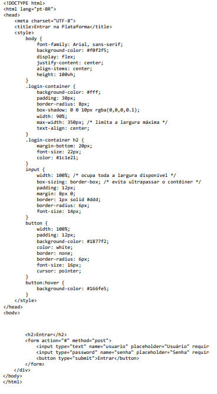
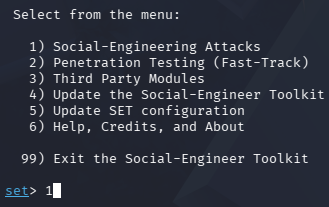
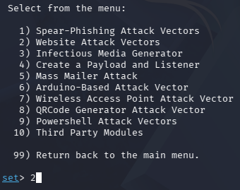
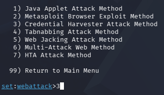
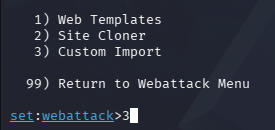
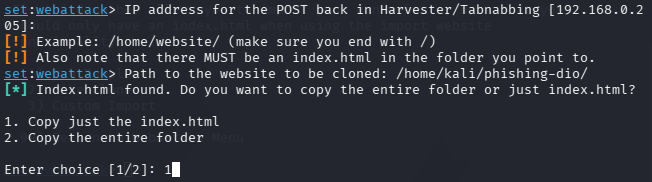

# 📘 Desafio DIO: Criação de um Phishing com o Kali Linux
## 🛠️ Metodologia
1. **Sistema Operacional**: kali linux
2. **Ferramenta utilizada**: setoolkit
3. **Simulação**: criação de uma página de login falsa (index.html)

   ⚠️ **Aviso importante:** Nenhuma credencial real foi coletada. O desafio é estritamente educacional e não deve ser utilizado para fins maliciosos.
## ⚙️ Configuração do Ambiente
**Acesso root:** `sudo su`

**Iniciando o setoolkit:** `setoolkit`

**Tipo de ataque:** `Social-Engineering Attacks`

**Vetor de ataque:** `Web Site Attack Vectors`

**Método de ataque:** `Credential Harvester Attack Method` 

**Método de ataque:** `Custom Import`

**Obtendo o endereço da máquina:** `Index.html`
Informamos o caminho da criação do arquivo index.html (página de login falsa) no kali linux. Depois disso, há o direcionamento, a partir do IP da máquina, que serve a página de login falsa na porta 80.

## 📊 Resultados
